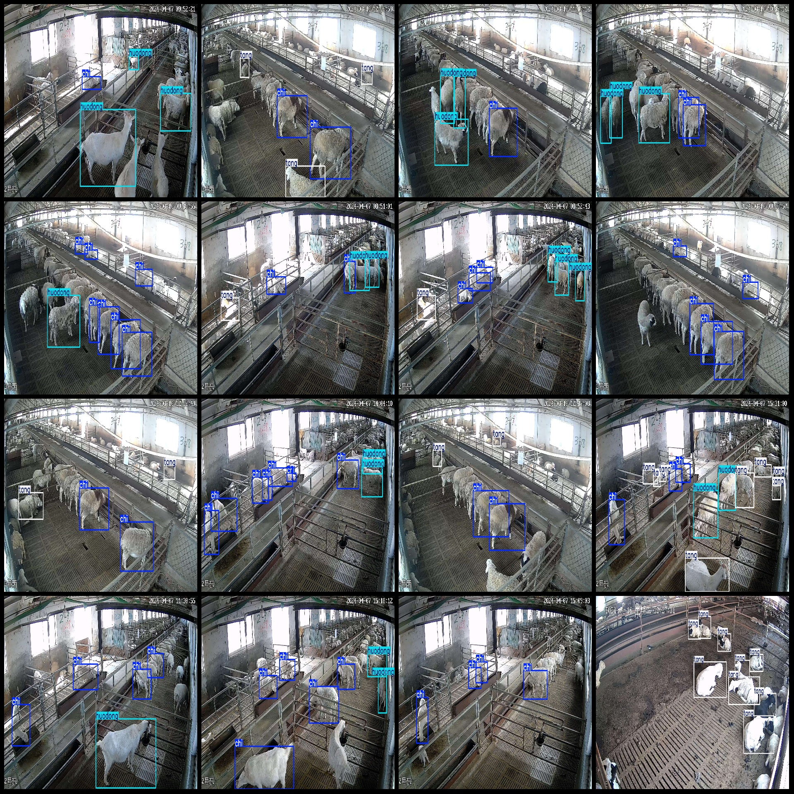
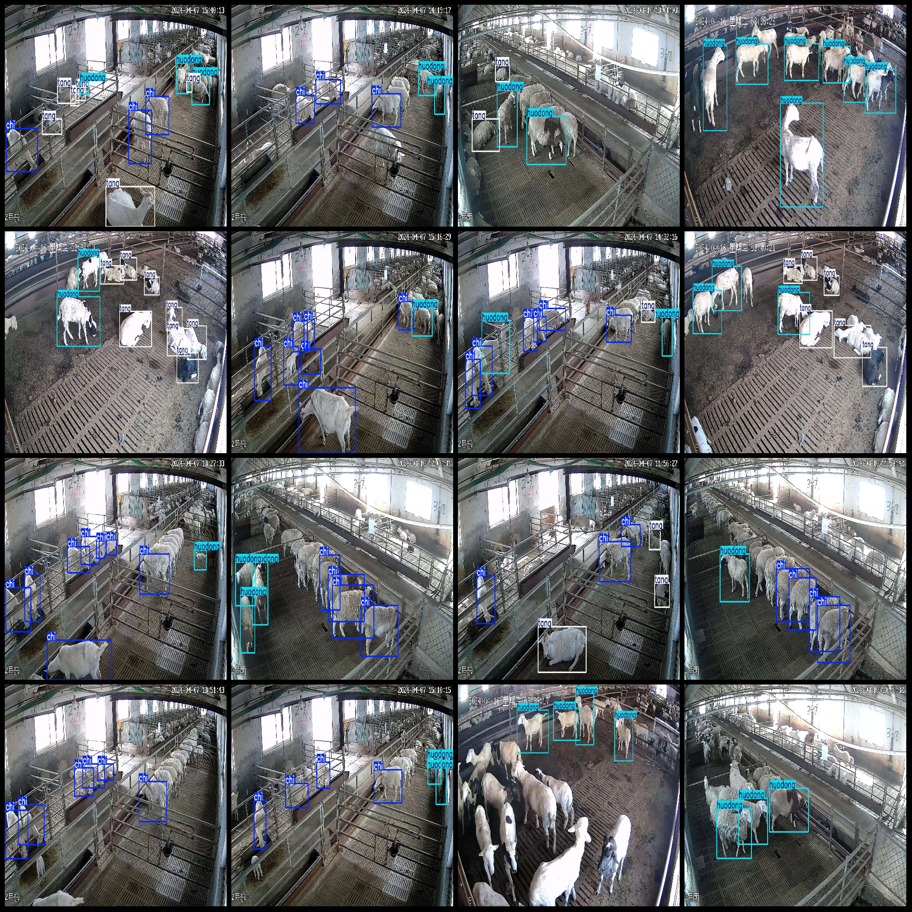

# Smart Farming Sheep Behavior Detection Dataset VOC+YOLO Format, 1916 Images in 3 Classes

The dataset format: Pascal VOC format + YOLO format (without split path in txt file, only containing jpg images along with corresponding VOC format xml files and YOLO format txt files).

Number of images (jpg file count): 1916
Number of annotations (xml file count): 1916
Number of annotations (txt file count): 1916
Number of annotation categories: 3
Annotation category names (notice the order of labels in YOLO format does not correspond to this, but based on the "classes.txt" in the labels folder): ["chi", "huodong", "tang"]
Each category has a number of bounding boxes:
- chi (Eating) = 5721
- huodong (Activity) = 3576
- tang (Lying) = 2448
Total bounding boxes: 11745
Number of images each category occupies:
- chi occupies images = 1643
- huodong occupies images = 1472
- tang occupies images = 792
Image resolution: 1920x1080
Annotation tool used: labelImg
Annotation rule: draw a square box around the category
Important note: The dataset does not have been divided into training, validation, or test sets; you need to do that yourself.
Special declaration: This dataset does not guarantee any accuracy of the trained model or weight files.
Image preview:
Annotation example:

## Images

Here is a pay link on Stripe ( https://buy.stripe.com/3cs8yP7sY87d0vu9AB ). Please contact me lonlonago@foxmail.com after funding $89, and I will send you a complete data files , thank you!

